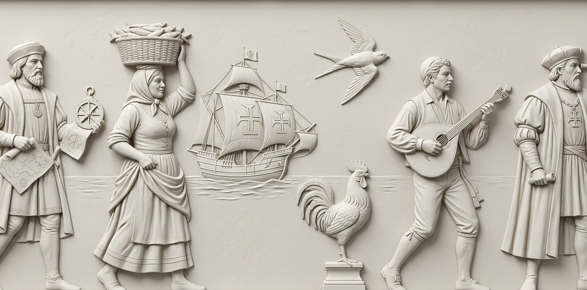

<div align="center">

Team Week — Offsite Landing Page Template

A one-page, zero-dependency website template for company offsites, retreats, team weeks
and small conferences. Built as a full-bleed panel grid of tone-on-tone plaster reliefs,
one strong accent colour, an animated hand-inked wordmark, a day-by-day agenda,
a spoken phrasebook and an FAQ accordion.



</div>

---

## What's inside

| Section                   | What it does                                                                                                                         |
| ------------------------- | ------------------------------------------------------------------------------------------------------------------------------------ |
| **Hero**                  | Big SVG wordmark with a living "hand-inked" wobble (animated turbulence filter) and a ghosted ceramic emblem behind the letters.     |
| **The Facts**             | Dates, headcount, hotel and the one-line promise, in a bordered card that fades in on scroll.                                        |
| **Welcome column**        | A drawn SVG column holding the welcome note and the sign-off.                                                                        |
| **What you should bring** | Two-column packing list with roman numerals and hover states.                                                                        |
| **Media panels**          | Rosette + medallion with a play button, sound toggle and caption.                                                                    |
| **Agenda**                | One panel per day: day header bar, time, title, description, dashed separators, staggered reveal.                                    |
| **Phrasebook**            | 16 phrases, each with a vessel silhouette and two play buttons that speak the phrase with the browser voice (pulsing while playing). |
| **FAQ**                   | Accordion with +/− toggle, smooth open/close, one open item at a time.                                                               |
| **Footer**                | Wide relief frieze with a caption bar.                                                                                               |

**Tech:** hand-written HTML, one CSS file, one small JS file (≈180 lines).
No framework, no build step, no tracking, no npm. Fonts are self-hosted, so the page
works fully offline.

---

## Quick start

1. Download or clone this repository.
2. Open `index.html` in a browser. That's it — there is nothing to compile.

For a local server (nicer for testing, avoids `file://` quirks):

```bash
python3 -m http.server 3000
# then open http://localhost:3000
```

---

## File structure

```
.
├── index.html              ← all page content lives here
├── css/
│   └── style.css           ← design tokens, grid, components, breakpoints
├── js/
│   └── main.js             ← phrasebook data, play buttons, FAQ, scroll reveals
├── assets/
│   ├── favicon.svg
│   ├── fonts/              ← self-hosted webfonts + fonts.css
│   └── img/                ← relief artwork (PNG)
├── .gitignore
├── LICENSE
├── GITHUB-GUIDE.md         ← step-by-step publishing guide (drag & drop)
└── README.md
```

---

## Customising

### 1. Colours

Everything is driven by tokens at the top of `css/style.css`:

```css
:root {
  --blue: #0755bb; /* accent: headlines, links, buttons, silhouettes */
  --paper: #dcdbd5; /* panel surface */
  --page: #cbcbcb; /* the 2px grid lines between panels */
  --bar: #e8e8e8; /* inner bars: facts card, list rows, FAQ rows */
  --ink: #333333; /* pulse colour of playing buttons */
}
```

Change `--blue` and the whole site re-themes: wordmark, links, vessels, play buttons,
FAQ signs and the column.

### 2. Text

All copy is plain HTML in `index.html`, in the order it appears on the page.
The phrasebook is the only content held in JS — edit the `PHRASES` array in
`js/main.js`:

```js
['English label', 'pho-NEH-tic spelling', 'Native spelling'],
```

The third value is what the browser voice speaks. Change the language by editing
`data-lang` / the `u.lang` value (e.g. `'es-ES'`, `'it-IT'`, `'de-DE'`).

### 3. Images

Replace the PNGs in `assets/img/` keeping the same file names, or update the `src`
attributes. Recommended sizes:

| File                                                                                                  | Ratio | Used for                      |
| ----------------------------------------------------------------------------------------------------- | ----- | ----------------------------- |
| `frieze-wide .jpg`                                                                                    | 2:1   | wide relief next to The Facts |
| `busts-left.jpg`, `busts-right.jpg`, `suitcases.jpg`, `day-one.jpg`, `day-two.jpg`, `faq-relief .jpg` | 1:2   | tall side panels              |
| `rosette.jpg`, `medallion .jpg`                                                                       | 1:1   | square panels                 |
| `footer-frieze .jpg`                                                                                  | 3:1   | footer                        |

Panels crop with `object-fit: cover`, so anything close to the ratio works.
Tune the crop with `transform: scale()` in `.visual img`.

### 4. Grid

The whole page is one CSS grid of three columns whose row height equals the column
width (`--unit`). Panels use the helpers `.span-2`, `.span-3`, `.row-2`, `.row-3`.
Adding a new panel is one `<section class="panel …">`.

### 5. Fonts

Self-hosted in `assets/fonts/` and declared in `assets/fonts/fonts.css`:
**Cinzel** (display / caps), **Spectral** (body), **Albert Sans** (micro labels).
All three are under the SIL Open Font License. Swap the files and the three
`--font-*` tokens to re-voice the typography.

---

## Accessibility & performance

- Semantic landmarks, labelled buttons, `aria-expanded` on the accordion.
- Full keyboard operation (all controls are real `<button>` elements).
- `prefers-reduced-motion` disables every animation and reveal.
- No external requests at runtime → fast first paint and GDPR-friendly by default.
- Speech playback uses the built-in Web Speech API; if a browser doesn't support it,
  the buttons still animate and nothing breaks.

## Browser support

Chrome, Edge, Safari and Firefox (current versions). Speech output depends on the
voices installed on the visitor's device.

---

## License

MIT for the code — see [LICENSE](LICENSE).
The images in `assets/img/` are generated artwork included with the template;
you may use, edit and replace them in your own projects.

<div align="center">
If this template is useful, please leave a star ⭐ on GitHub to show your support!
</div>
